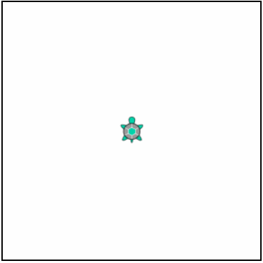
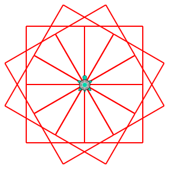
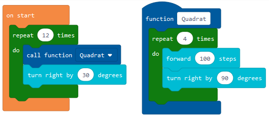
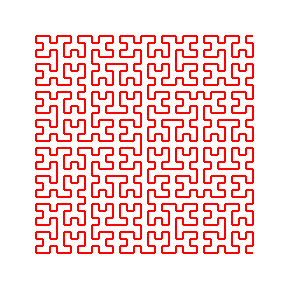
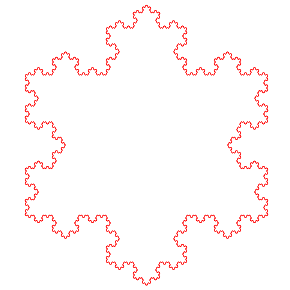

# Turtle Editor #

*pxt-turtle* is a programming environment fur [turtle graphics](https://en.wikipedia.org/wiki/Turtle_graphics), based on [Microsoft MakeCode](https://github.com/Microsoft/pxt). It's meant for teaching beginners in programming fundamentals.

## Features ##

### Animated turtle graphics ###

(Turtle design taken from https://github.com/ycatch/p5.turtle.js, [CreateJS](https://createjs.com/) used as animation framework)

### Visual programming ###
 

## Further examples ##

### [Tree](examples/tree.js) ###

### [Hilbert](examples/hilbert.js) and [Koch](examples/koch.js) curves ###
 

## API ##

    declare namespace turtle {
        function forward(distance: number): void;
        function backward(distance: number): void;
        function turnRight(angle: number): void;
        function turnLeft(angle: number): void;
        function penUp(): void;
        function penDown(): void;
        function home(): void;
        function x(): number;
        function y(): number;
        function heading(): number;
        function setSpeed(speed: Speed): void;
        function setPenColor(color: number): void;
        function setPenSize(size: number): void;
        function show(): void;
        function hide(): void;
        function goto(xpos: number, ypos: number): void;
        function printAndMove(text: string): void;
        function print(text: string): void;
        function clear(): void;
    }

    declare const enum Speed {
        Slow, Normal, Fast, Fastest
    }

    declare namespace time {
        function wait(delay: number): void;
        function now(): number;
        function year(ts: number): number;
        function month(ts: number): number;
        function day(ts: number): number;
        function hours(ts: number): number;
        function minutes(ts: number): number;
        function seconds(ts: number): number;
    }

    declare namespace console {
        function log(msg: string): void;
    }

## How to build ##
*pxt-turtle* uses [Yarn](https://yarnpkg.com/) for dependency management. To install the needed packages, simply execute `yarn` in the project root folder.

### Start in development mode ###

    yarn start

### Publish as GitHub pages ###

    yarn build --githubpages
