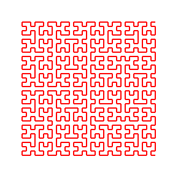

# Turtle Editor #

*pxt-turtle* is a programming environment fur [turtle graphics](https://en.wikipedia.org/wiki/Turtle_graphics), based on [Microsoft MakeCode](https://github.com/Microsoft/pxt). It's meant for teaching beginners in programming fundamentals.

## Features ##

### Animated turtle graphics ###

(Turtle design taken from https://github.com/ycatch/p5.turtle.js, [CreateJS](https://createjs.com/) used as animation framework)

### Visual programming ###
 

## Further examples ##

### [Tree](examples/tree.js) ###

### [Hilbert Curve](examples/hilbert.js) ###

## How to build ##
*pxt-turtle* uses [Yarn](https://yarnpkg.com/) for dependency management. To install the needed packages, simply execute `yarn` in the project root folder.

### Start in development mode ###

    yarn start

### Publish as GitHub pages ###

    yarn build --githubpages
